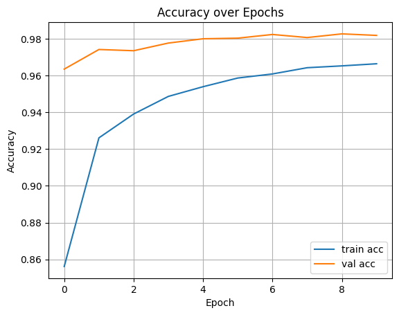
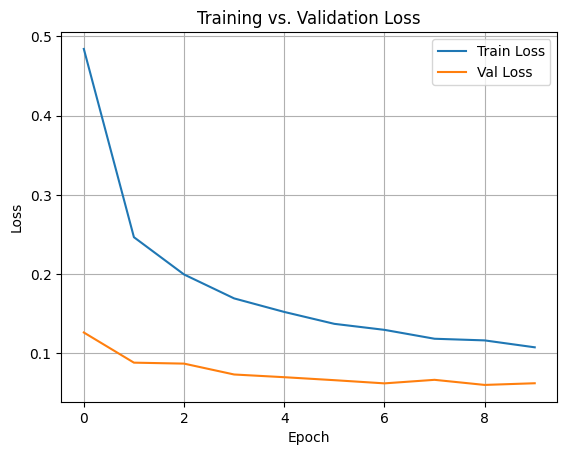

# 🔢 MNIST Digit Classifier

A deep learning project to classify handwritten digits (0–9) from the MNIST dataset using a fully connected neural network built with TensorFlow/Keras.

## 🎯 Objective

Build and evaluate a deep learning model with:
- Batch Normalization
- Dropout Regularization
- Training & Validation Accuracy Visualization

## 🗂️ Dataset

Loaded from `tensorflow.keras.datasets.mnist`  
Includes 60,000 training and 10,000 test grayscale images (28x28 pixels).

## 🛠️ Model Architecture

- Input Layer: Flattened 784-d input
- Hidden Layers:
  - Dense (256 units) + BatchNorm + LeakyReLU + Dropout(0.4)
  - Dense (128 units) + BatchNorm + LeakyReLU + Dropout(0.3)
  - Dense (64 units)  + BatchNorm + LeakyReLU + Dropout(0.2)
- Output Layer: Dense(10, softmax)

## ⚙️ Training

- Loss: `categorical_crossentropy`
- Optimizer: `adam`
- Epochs: 10
- Batch Size: 64
- Validation Split: 10%

## 📊 Evaluation

- Final **Test Accuracy**: ~97.9%
- Visualized training vs. validation accuracy and loss

## 📈 Results




## 📦 Requirements

```bash
tensorflow
numpy
matplotlib
